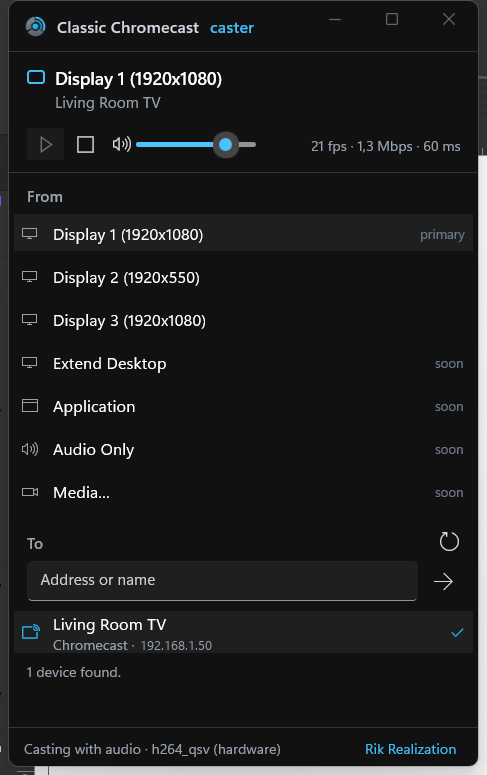

# Classic Chromecast caster

Low-latency desktop and audio mirroring to **classic Chromecast hardware** (Gen 1, 2, 3
and Ultra), for Windows. An independent alternative to AirParrot 3, built around the same
Cast Streaming protocol that Chrome itself uses — so it works on the old pucks without a
Google developer account, a hosted receiver, or a browser in the loop.

By [Rik Realization](http://rikrealization.com/).

> **Status: early, but it mirrors a live desktop to a TV.** Discovery, the CASTV2 control
> channel, Cast Streaming negotiation, encrypted RTP, screen capture and hardware encoding
> all work against real hardware, at 1080p30 with system audio, driven from a branded
> WinUI 3 window. Displays, single windows and audio-only can be cast, dashboards and slide
> decks are recognised and given a smoothness-first profile, and an HLS fallback exists for
> devices that will not mirror. Reaching 1080p60 needs an in-process encoder rather than an
> ffmpeg subprocess.
> See [docs/architecture.md](docs/architecture.md) for the plan and
> [docs/latency.md](docs/latency.md) for the latency budget.

## Why

Google has steadily walked away from the original Chromecast line. Chrome's own tab
mirroring is the only easy way to get a desktop onto a Gen 1/2/3 device, and it is slow,
tied to a browser process, and unaware of what you are actually trying to show. The
hardware is still everywhere, still works, and still has hardware H.264 decode.

## Approach

| Layer | Choice |
| --- | --- |
| Transport | Cast Streaming — the built-in `Chrome Mirroring` receiver, app ID `0F5096E8`, namespace `urn:x-cast:com.google.cast.webrtc` |
| Control | CASTV2 over TLS on port 8009, protobuf framing |
| Capture | DXGI Desktop Duplication, with a GDI fallback. WASAPI loopback for audio |
| Video | H.264 via NVENC / QuickSync / AMF, low-latency tune; software VP8 fallback |
| Audio | WASAPI loopback capture, Opus via Concentus |
| Latency | 60 ms playout delay by default, adapted from RTCP feedback |
| UI | WinUI 3, .NET, brand accent `#27adef` |
| Cast core | Pure C#, ported against Chromium's Open Screen Library as the reference spec |

Deliberately **not** used: a custom Web Receiver. WebRTC in a custom receiver is only
supported on Chromecast with Google TV and Nest displays — not on the classic pucks this
project targets. LL-HLS through a custom receiver would work but lands at seconds, not
milliseconds.

## Repository layout

```
brand/            Logo sources (SVG is the source of truth) + build-assets.sh
docs/             Architecture and latency notes
ProjectFiles/     Solution and source
tools/            Helper scripts (test-pattern generation)
```

## Running the app

```bash
cd ProjectFiles
dotnet run --project src/RikRealization.ClassicCast.App
```

Pick a display under **From**, a device under **To**, and press play. Needs ffmpeg on the
path for encoding.



## Trying the protocol spike

```bash
cd ProjectFiles
dotnet run --project src/RikRealization.ClassicCast.Spike -- --help

# browse for devices only
dotnet run --project src/RikRealization.ClassicCast.Spike

# launch the mirroring receiver and negotiate a session
dotnet run --project src/RikRealization.ClassicCast.Spike -- --negotiate

# render the OFFER we would send, without touching the network
dotnet run --project src/RikRealization.ClassicCast.Spike -- --print-offer

# put a test pattern on the screen (generate it first)
bash ../tools/make-test-pattern.sh
dotnet run --project src/RikRealization.ClassicCast.Spike -- --send-test-pattern

# mirror the live desktop
dotnet run --project src/RikRealization.ClassicCast.Spike -- --list-displays
dotnet run --project src/RikRealization.ClassicCast.Spike -- --mirror

dotnet test
```

`--negotiate` takes over the target device's screen until you press Ctrl+C, which stops
the receiver app and hands the TV back.

## Building the brand assets

```bash
bash brand/build-assets.sh      # needs Inkscape + ImageMagick
```

## Privacy and network behaviour

Worth knowing before you run it, because this software captures your screen and puts it
on the network.

- **Nothing is sent anywhere but your own device.** There is no telemetry, no analytics,
  no crash reporting and no update check. The only outbound connections are to the
  Chromecast you select, on your local network.
- **Nothing is written to disk** except the temporary HLS segments described below, which
  are deleted when the session ends. No settings file, no log file, no registry keys.
- **The HLS fallback serves your screen unauthenticated.** When that path is used it opens
  an HTTP server on your LAN address with a random port and no access control, because the
  Default Media Receiver cannot present credentials. Anyone on the same network who finds
  the port can watch. The mirroring path — the default — does not do this: it sends
  encrypted RTP to the one device you chose.
- **The device's TLS certificate is not verified.** Chromecasts present self-signed
  certificates and the Cast protocol offers no way to establish a chain of trust, so the
  channel is encrypted but the identity is not checked. An attacker already positioned on
  your network could impersonate a device. This is a property of the protocol, not a
  shortcut taken here.

## Licence

[Apache License 2.0](LICENSE). See [NOTICE](NOTICE) for third-party components,
trademarks, and what a binary release bundles.

ffmpeg is not bundled — you supply it. This project distributes no ffmpeg code.

## A note on the name

"Chromecast", "Google Cast" and "Google" are trademarks of Google LLC; "AirParrot" is a
trademark of Squirrels LLC. This project is an independent work and is not affiliated
with, endorsed by, or sponsored by either company. Their names appear here only to
describe the hardware this software talks to and the product it is an alternative to. See
[NOTICE](NOTICE).
